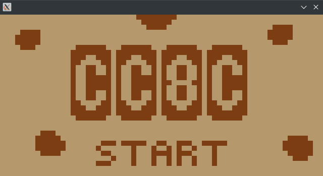
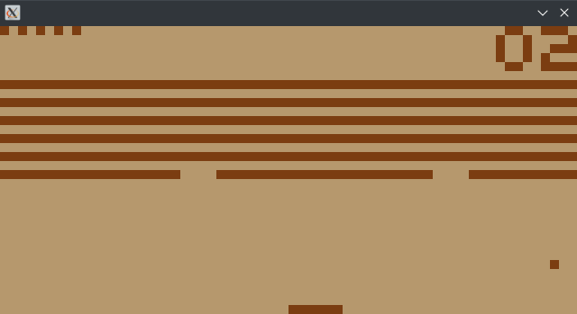
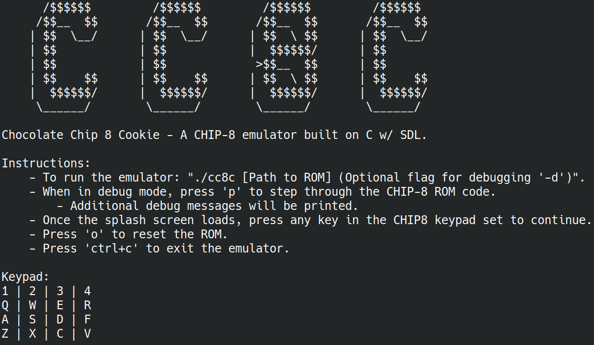
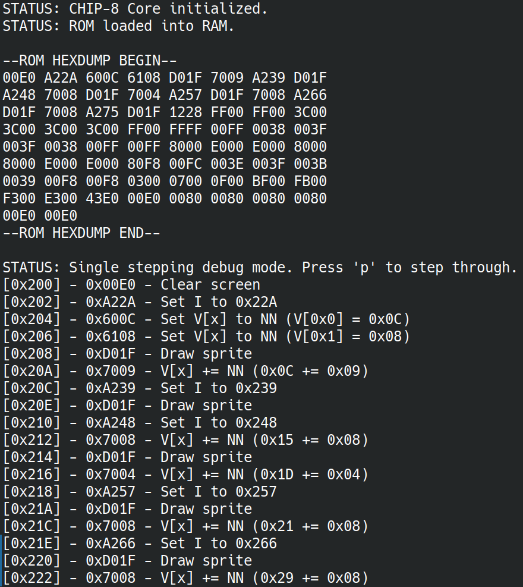

                  /$$$$$$         /$$$$$$         /$$$$$$         /$$$$$$ 
                 /$$__  $$       /$$__  $$       /$$__  $$       /$$__  $$
                | $$  \__/      | $$  \__/      | $$  \ $$      | $$  \__/
                | $$            | $$            |  $$$$$$/      | $$      
                | $$            | $$             >$$__  $$      | $$      
                | $$    $$      | $$    $$      | $$  \ $$      | $$    $$
                |  $$$$$$/      |  $$$$$$/      |  $$$$$$/      |  $$$$$$/
                 \______/        \______/        \______/        \______/
                 

# Chocolate Chip 8 Cookie
A CHIP-8 emulator built in C with SDL.

| Splash Screen | Breakout Screenshot |
|:--------:|:-----------------:|
|||

| Console Output | Debug Output |
|:--------:|:-----------------:|
|||

### Dependencies
- GCC
- SDL2
- Make
- Compatible CHIP8 ROM

### Build
```
cd src
make
```

### Run
```
./cc8c [Path to ROM] (Optional flag for debugging '-d')
```
Further instructions will be printed out once the emulator is run or you may also view ./src/instructions.txt as well.

### Resources
For anyone else that wants to make their own CHIP8 emulator:
- [Guide to making a CHIP-8 emulator](https://tobiasvl.github.io/blog/write-a-chip-8-emulator/) - High level overview of the CHIP8 instruction set without spoiling the implementation details.
- [Chip-8 on the COSMAC VIP: Arithmetic and Logic Instructions](https://www.laurencescotford.net/2020/07/19/chip-8-on-the-cosmac-vip-arithmetic-and-logic-instructions/) - Provides a deeper dive into the 0x8000 opcode operations. Necessary for proper implementation of the arithmetic and logic instructions. Provides better insight on the nuances of the V[0xF] post execution values. Pairs nicely with the Corax+ opcode test and flags test.
- [chip8-test-suite](https://github.com/Timendus/chip8-test-suite/tree/main) - Test suite for iteratively testing different opcodes and features. 
- [Octo GitHub](https://github.com/JohnEarnest/Octo) or [Octo Online](http://johnearnest.github.io/Octo/) - CHIP8 IDE that was used for writing the splash screen sprites and display code.
